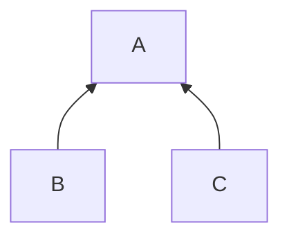
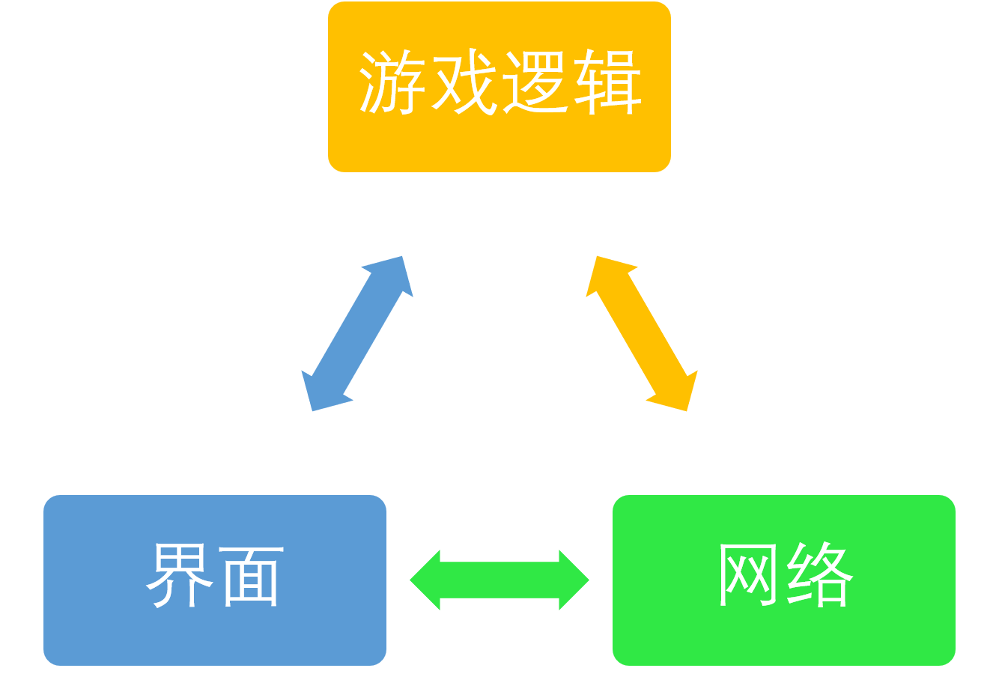

# 设计文档

本次大作业由两个核心环节组成：网络与游戏逻辑。在编码过程中，我尽量遵循面向对象的设计原则，并**让这两个环节充分解耦**。实践表明，这对后续实现具体逻辑以及热重启等部分均有益处。

## 网络

### 连接方式

我将一个客户端（A）提升至相对中心的地位，另外两个客户端（B、C）向这个相对中心的客户端发起连接请求，如下图所示：



进行网络通信时，若A需要发送消息，则**直接向B和C广播**；若B（或C）需要发送消息，则先直接向A发送，**再经由A向C（或B）转发**。

由于本次大作业中不存在冲突的场景，在此不对这方面进行处理。

### 一个编译目标，两种网络策略

由上文可见，A与B、C在网络方面处于不同的地位，需要采取不同的网络策略。

**我希望在一个可执行文件中同时支持两种网络策略，以便用户自行选择自己的客户端在网络连接中的角色。**此外，界面和游戏逻辑的代码应当尽可能地复用。为此，**网络部分需要与其它代码充分解耦**。

我采取了**策略模式**：**设置一个抽象基类`NetworkPolicy`**，其成员由两个信号`postMessageToWelcome`（向准备页面报告连接状态）、`gameStarts`（通知准备页面游戏开始）和两个纯虚函数`linkWithWelcome`（将当前网络策略链接至准备界面）、`linkWithLogic`（将当前网络策略链接至游戏逻辑）组成。针对两种不同的网络策略，**定义相应的`DecentralizedServer`和`DecentralizedClient`派生类**，完成网络请求有关的功能，并根据具体行为的需求，实现基类的`linkWithWelcome`和`linkWithLogic`方法。

这一系列操作完成后，**外界并不需要知道底层的网络实现——甚至不用知道自己是Client还是Server——只需使用基类`NetworkPolicy`暴露出的信号和成员方法，即可进行网络通信**。

### 通信协议

在本次大作业中，我采用**“长度+消息”**的结构表示一个包。具体而言，先用4字节传输消息的文本长度，再跟随其后传输消息的具体数据。

在实际业务中，需要发送的消息可分为多种类别，如“叫主”“出牌”。为此，**我将消息进一步封装为一个由消息类别和消息内容组成的结构**：

```C++
struct Message {
    Type type;
    QString payload;
};
```

其中，`Type`是一个枚举类型：

```C++
enum Type {
    undefined,
    CONFIRM_CONNECTION,
    GAME_STARTS,
    CALL,
    NOT_CALL,
    DISCARD,
    PASS,
    RESTART,
    QUIT,
};
```

发送消息数据时，先将`type`的枚举序转成字符串后，添加一个空格，再将`payload`拼接其后。`payload`的具体格式由相应类别决定。`undefined`用于表示接收终止。

一个简单的示例如下：

<code><span style="color:red">000D</span><span style="color:blue">5</span> <span style="color:green">3,3,4,4,5,5</span></code>，表示打出3,3,4,4,5,5，其中红色的000D表示消息数据长度为13，蓝色的5表示发送的是第五类消息（`DISCARD`），绿色的则是具体的消息内容。

在实际操作中，为方便起见，我对收发消息环节进行了简易的封装，可参见`network/utils.cpp`。

## 游戏逻辑

### 总体设计

注意到本次作业有热重启的需求，一个较为合理的实践是**将牌局抽象为一个独立的游戏逻辑，并与界面部分解耦，只通过调用方法和信号槽等机制进行必要的通信**。

三个玩家的游戏逻辑之间需要通过网络进行交互。**幸而之前的网络部分已经进行了充分的抽象**，游戏逻辑只需与网络部分进行简单的消息传输，后续的行为可完全交由网络部分负责。



至此，**游戏逻辑、界面与网络三者之间充分解耦**，只保留必要的接口用于传递信息。带来的好处是：

- 网络策略可以任意指定；
- 游戏逻辑可以方便地实现热重启。

### 事件同步

从游戏逻辑的角度，并不需要一个中心化的节点来进行事件的同步，也不需要复杂的转发技巧。只需某一方的游戏逻辑发起某一事件后，将这一事件的信息通过网络层告知另外两个玩家，另外两个玩家的游戏逻辑对这一事件同样进行模拟，这样就保证所有玩家的游戏逻辑都是同步的了。

### 规则判定

在规则判定方面，本次大作业中，我在算法层面并没有什么特别的技巧。**主要的技巧在代码层面：采用了工厂模式辅助规则的处理。**

我首先创建了一个抽象基类：

```C++
class Pattern {
public:
    virtual ~Pattern() = 0;

    virtual bool operator<(const QStringList &other) = 0;
};
```

其中，要求对`<`运算符进行重载，用于大小的比较——若另一个牌型合法，且能够压住当前牌，就返回`true`，否则返回`false`。

对于每一种具体的牌型，都创建一个派生类，除了实现`<`运算符的重载，还需要添加一些具体信息，比如“顺子”中最小的一张牌的大小。

在合法性判断方面，我声明了一个判断函数：

```C++
template<typename T>
bool matches(const QStringList &cards);
```

并通过对`T`进行特化来进行具体类型的判断。**牌型判断的一些细节在后面补充。**

做好了上述准备工作后，工厂函数就呼之欲出了。此处仅截取一小段：

```C++
Pattern *makePattern(const QStringList &cards) {
    if (matches<Single>(cards)) {
        return new Single(cards);
    } else if (matches<Pair>(cards)) {
        return new Pair(cards);
    } else if (matches<Triple>(cards)) {
        return new Triple(cards);
    /* ... */
    } else {
        return nullptr;
    }
}
```

通过这一系列设计，我们可以用相对漂亮的代码完成规则判定的逻辑，并且在有新规则加入时也能灵活拓展。

这里补充几个细节。

- **所有的判断均在卡牌排序后进行。**这会为处理带来许多方便之处，例如判定“四带两对”，八张卡牌原本会有数不清的排列方式，但排序后，合法的牌型只有三类，大大简化了判断。还例如，找寻“三带”中“三”的大小，排序后只要找到下标为2的那张牌即可，无论是“三带一”“三带二”还是”三带零“。
- **所有大小比较均在合法性判断后进行。**一个有代表性的例子是“飞机”——“飞机不带翼”“飞机带小翼”“飞机带大翼”的区分必不可少。在合法性未知的条件下，这一判断较为繁琐。但在确定合法的前提下，只要用卡牌的总数除以“三带”的个数，即可判断得到相应的子类别信息。

具体的代码实现参见`game/patterns.h`和`game/patterns.cpp`。

## 客户端工作流程

### 界面

按照要求，本次作业中共创建了两个页面：**准备页面和游戏页面**。程序启动时，打开准备界面，等待用户选择联网策略，并随后进行网络连接的建立。待三个客户端成功连接后，进行如下操作：

- Server随机生成一个新的牌局，包含顺序和洗好的牌叠；
- Server将牌局信息作为参数传给游戏页面，同时向两个Client发送以`GAME_STARTS`为`type`，以牌局信息为`payload`的消息；
- Client收到消息后，将接收到的牌局信息传给游戏界面；
- 游戏界面接收到牌局信息后，根据牌局信息构造出一个新的`GameLogic`游戏逻辑对象；
- 将游戏逻辑对象与网络层连接；
- 进行游戏事件的响应和处理。

### 热重启

热重启需要进行以下操作：

- 游戏逻辑收到热重启的信号，告诉界面层需要进行热重启；
- 游戏逻辑与网络层断开连接，并回收游戏逻辑对象；
- 如果当前客户端为Server，则重新生成一个牌局；
- 重复上一节第2~6步操作。

热重启即可完成。

## “粘包”的处理

其实约定了通信协议后，“粘包”问题已不难处理。关键代码如下：

```C++
while (true) {
    if (socket->waitForReadyRead()) {
        Message message;
        while ((message = read(socket)).type) {
            logic->onMessage(message);
        }
    }
}
```

注意到之前约定`Message`的`type`为`undefined`（对应`0`）表示读取终止，因此这段代码可以正确地实现读取消息并发送给游戏逻辑的功能。

## 心得

- 虽然`Qt`为socket进行了良好的封装，socket本身也没有太多复杂的地方，但实际动手时仍然容易遇到这样那样的问题。这只能通过不断积攒经验来克服了。
- 从完成大作业的角度，诸如冲突、连接失败等异常处理并不需要考虑。但如果要放到生产环境下，无论是异常处理，还是为确保不发生异常而做的验证操作，都是不可或缺的。可见我们当前的成果离生产级别还有不小的距离。

